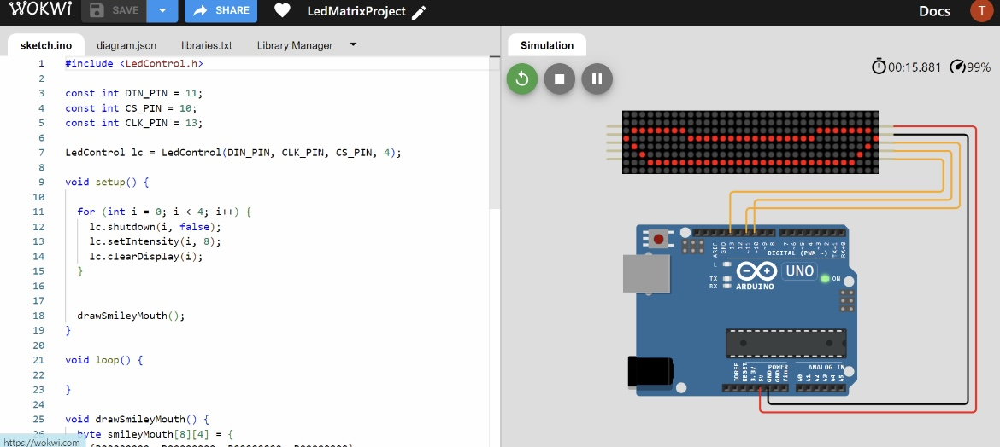

# Robot Mouth LED Matrix

## Description

This project demonstrates how to design a robot's mouth using an LED matrix (MAX7219) to display a smiling face. The project uses an Arduino Uno to control a 33x8 LED matrix, creating a robotic smile.

## Project Details

1. **Platform**: Arduino Uno
2. **LED Matrix**: MAX7219
3. **Matrix Size**: 33x8

## How to Set Up

1. **Open Wokwi** and create a new project using Arduino Uno.
2. **Add the LED Matrix** with the type MAX7219 and set its size to 33x8.
3. **Connect the components** as follows:
   - **DIN** (Data In) pin of the MAX7219 to **Pin 11** on the Arduino Uno
   - **CS** (Chip Select) pin of the MAX7219 to **Pin 10** on the Arduino Uno
   - **CLK** (Clock) pin of the MAX7219 to **Pin 13** on the Arduino Uno
4. **Upload the provided Arduino code** to create a smile on the LED matrix (you can use the provided code in your own Arduino IDE or Wokwi).

## Images

## Link

**Project Link**: [Wokwi Project](https://wokwi.com/projects/404727588982433793)

